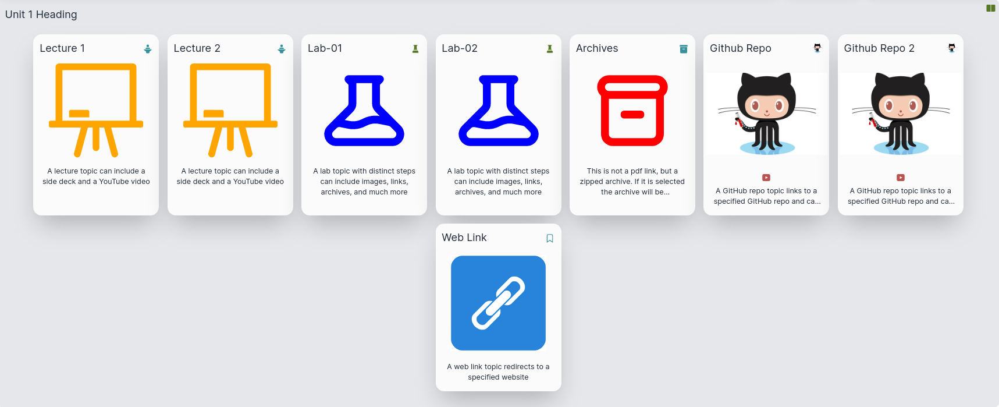
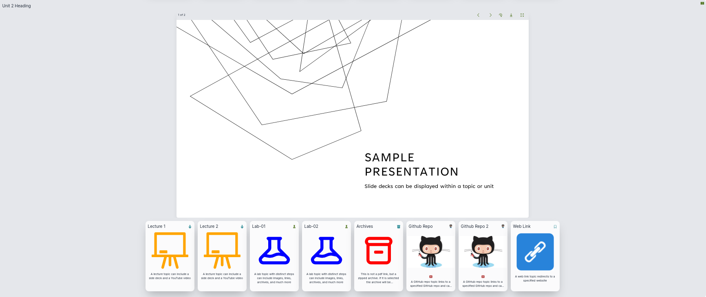

# Tutors Elements

Each element in Tutors is represented by a card with a particular icon. This image depicts most topic types and their corresponding icons:
  

The following is the sample Tutors course template used in this lab step which contains a sample of each topic type. This can be used to incorporate additional topic types into your own course, or just to further help understand topic structure.
  - [Sample Template with all Topic Types](archives/tutors-topics.zip)

There are five topic types that can be utilised, as well as the option of displaying a `.pdf` file in either a `topic` or `unit`:

- **Lecture**: These are represented in the file structure as `talk-*` and can contain a `.pdf` file, viewable as a slide deck, as well as a YouTube link or embedded video.

- **Lab**: Represented in the file structure as `book-*` and contains a series of `.md` Markdown files, each containing a complete Lab step.

- **Archives**: Represented in the file structure as `archives` and links to a `.zip`, `.rar`, `.tar.gz` file to be downloaded. Archives can also be placed within a Labs `archives` folder.

- **GitHub Repository**: Represented in the file structure as `github-*-template-*` and contains a file with a link to the specified GitHub repo. This file can be opened and edited by any text editor, Notepad for example.

- **Web Link**: Represented in the file structure as `web-1` and contains a file with a link to the specified website.

- **Panel Talk**: Represented in the file structure as `paneltalk` and contains a `.pdf` file which is displayed in the topic or unit in which the `paneltalk` folder is located.

Each of these folders also contain a `.md` Markdown file. These will be discussed in the next lab step.

- The following is an example topic which contains two units, each unit contains:
  - A Unit Heading
  - 2 Lecture topics
  - 2 Lab topics
  - 1 Archive topic
  - 2 GitHub Repo topics
  - 1 Web Link topic

Unit 2, while containing the same topics as Unit 1, also contains a `Panel Talk` which displays a `.pdf` file:

