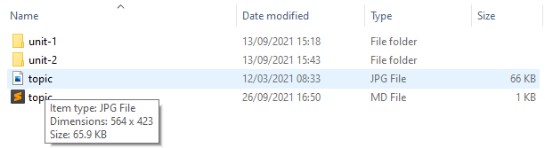

# Changing Card Images

Lets change the default card image with your own.

1. Select an image to use. This image must be a `.jpg` or `.png` file. You can download these from the web or they can be derived from screen shots on your own workstation.
2. In your `tutors-starter` folder, open `topic-01` and notice the `topic.jpg` file. Delete `topic.jpg` and replace it with your own image.
    

Republish the course (see last step of previous lab for a refresher on this).
