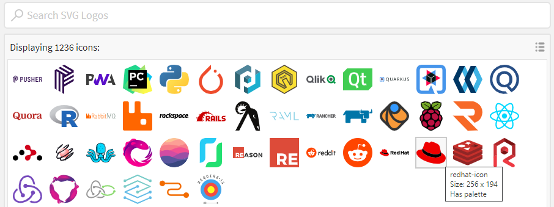

# Using Icons

Any given Element can, alternatively, have an Icon instead of a PNG of JPG image. This can be preferable in certain circumstances - if you are looking for a consistent UX for instance. Icons also work better when the users select different themes in Tutors.

To insert an icon, you will to select one from a specific service:

- <https://icon-sets.iconify.design/>

There are 100,000+ icons in this collection.

1. Navigate to [Iconify](https://icon-sets.iconify.design/) and either browse a specific icon set, to search based on some keyword.

    

    

3. From the results, select a specific icon:

    

4. This opens the icon details section. Copy the icon name:

    

5. Open any of the .MD files (course, topic, unit, talk, lab etc...) , then copy the fragment below into the top of the file, above the title, 
    ~~~md
    ---
    icon:
      type: logos:redhat-icon
    ---
    ~~~

    In the above we have selected the `logos:redhat-icon` icon.
    
5. Some icons can be changed colour (The color picker on the website does not dictate the colour, but is a clue as to which icons can be customised):

    

    ~~~
    ---
    icon:
      type: heroicons-outline:book-open
      color: red
    ---   
    ~~~

Rebublish the course to see the effect.
