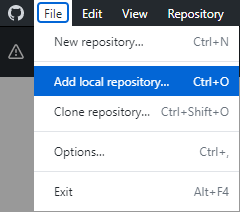
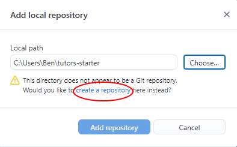
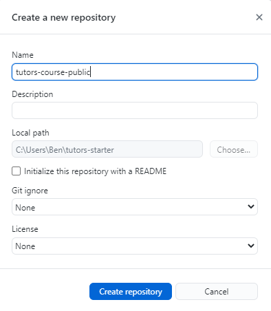
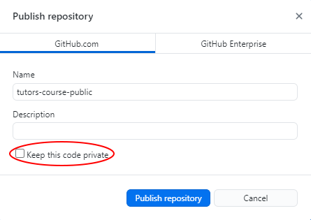

# Create a Remote Repository

1. In GitHub Desktop, navigate to `File` -> `Add local repository..`
    
2. Select `Choose`, then navigate to your `tutors-starter` folder.
3. As the folder is not linked to a remote repository, you will be prompted to `create a repository`, select the link shown here:
    
4. Enter your desired repository name and select `Create Repository`.
    
5. You will need to re-enter the repository name, then deselect the `Keep this code private` box and click `Publish repository`.
    
You now have a file structure stored in a remote repository on GitHub which is used by Netlify to build and deploy the course website.
In the next step you will configure Netlify and deploy your Tutors course.