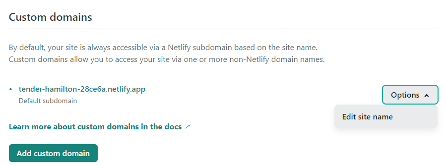

# Configure Netlify

1. Follow this link and login via GitHub:
    - [Login to Netlify](https://netlify.com)
2. Select `New site from Git`

3. Under Continuous Deployment, select `GitHub` as your Git provider.
    

4. Authorise Netlify to access your repository and select the repository from the list provided.
    

5. Under `Basic build settings`, enter the following:

`Build command:`
  ~~~
  tutors-json
  ~~~
`Publish directory:`
  ~~~
  json
  ~~~

6. Select `Deploy Site`

    

7. Netlify will build your website and set the status of the deploy to `Published`.
    
    
8. Select the `Domain settings` button and scroll down to the `Custom Domains` section.
    
9. Click the `Dropdown Options` button and select `Edit site name`.
    
10. Enter the desired domain name for your Tutors site and click `Save`.
    
11. Your site is now setup, click the link shown here to have a look.
    