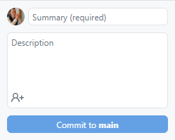
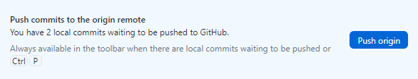
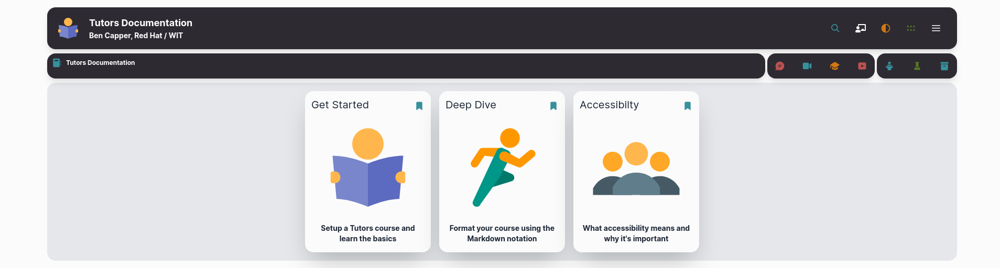

# Update via GitHub Desktop

**The following steps must be followed every time you wish to update the live site with the changes you have made**

1. Use Markdown to make some changes to your Tutors course.

2. For any change to take effect, you must open GitHub Desktop and enter a summary of your changes with an optional description. 

10. Press `Commit to main`. This will push updates from your local machine, into staging, ready to be pushed into the remote repository.

    

11. Now select `Push origin` to synchronise your local and remote repositories.

    

12. Netlify will automatically update your website with the changes pushed to the remote repository.

13. Open your course site in a browser and refresh the page. This may take ~30 secs, hold the `Shift` key and refresh the page to clear the page cache.
    
