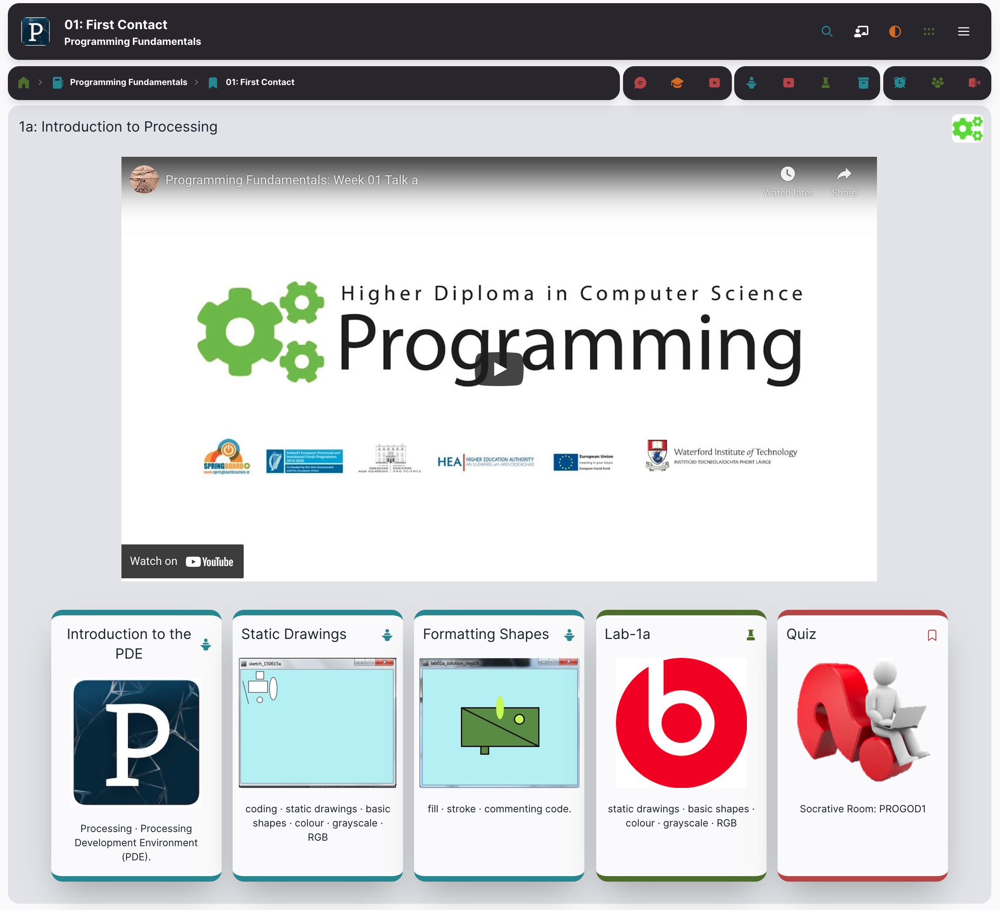
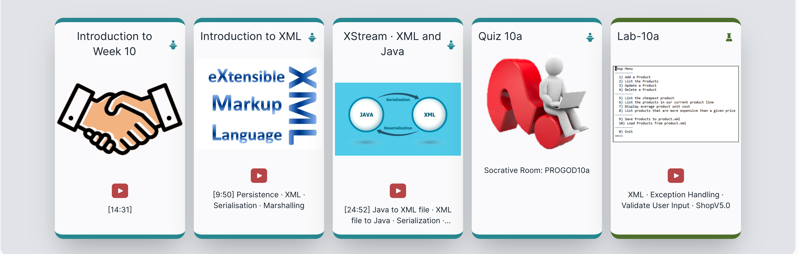

# Video Types

Videos are usually hosted on Youtube - and you will need a link to the video in order to embed in a tutors course. A typical URL looks like this:

~~~url
https://www.youtube.com/watch?v=Hfw1lbErjws
~~~

You will typically use the video id:

~~~
Hfw1lbErjws
~~~

... which is the last string after the `v=`.

Videos appear in a tutors course in three contexts:

### Panel Videos

These appear consuming the full width of the browser window, and often encompassing a complete lecture or class:

#### Card videos

Any individual card can have an associated video:

These are often shorter videos associated with a specific talk, lab or other learning resource.

### Video Only Cards

A talk card can have a video, but no associated PDF. This card will look the same as the cards above - but selecting the card will take you straight to the video instead of the PDF.
