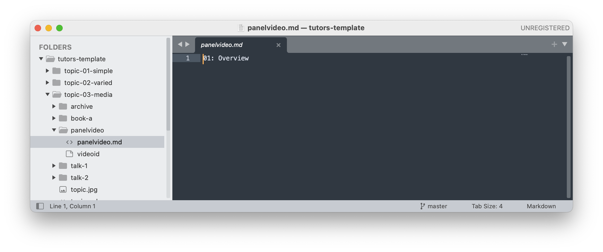
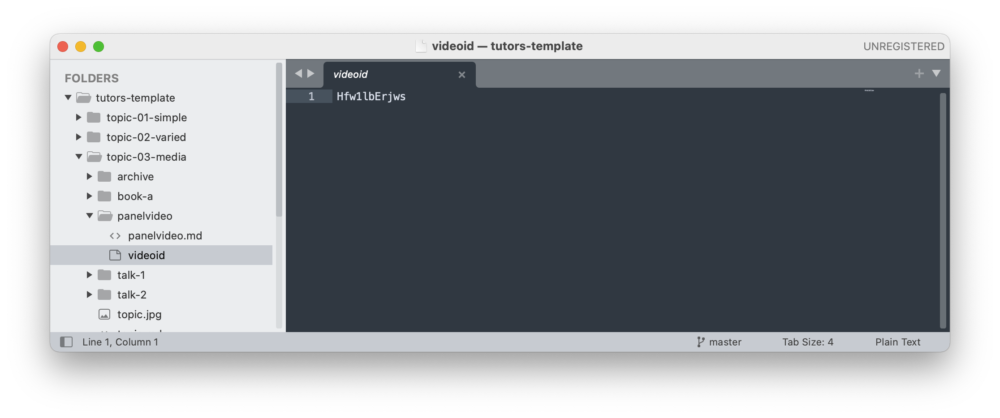

# Panel Videos

A panel video is created with a folder called `panelvideo` containing 

-  `panelvideo.md` file containing the video title
- `videoid` file containing the ID of the video

See this example here:

- <https://github.com/tutors-sdk/tutors-template/tree/master/topic-04-units/panelvideo>

Which renders like this:

- <https://tutors-next.netlify.app/#/topic/tutors-template.netlify.app/topic-03-media>

