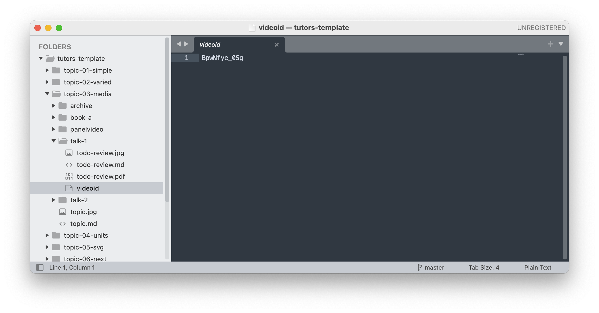
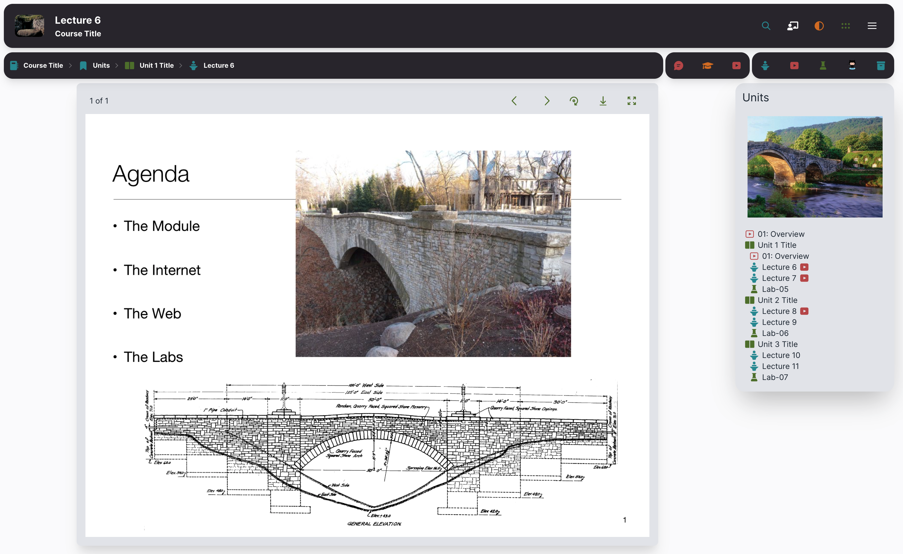
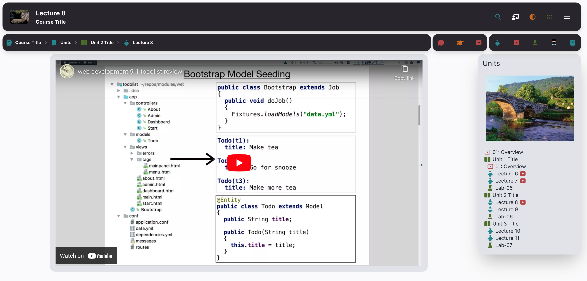

# Card Video

Any learning resource - a Talk, Lab or other resource - can have a videoed file:

This will insert a video play button on the associated card:

Selecting the card will display the PDF:

However, selecting the play button will take you directly to the video:

The Topic Navigator on the left will allow the user to switch between the video or the presentation

