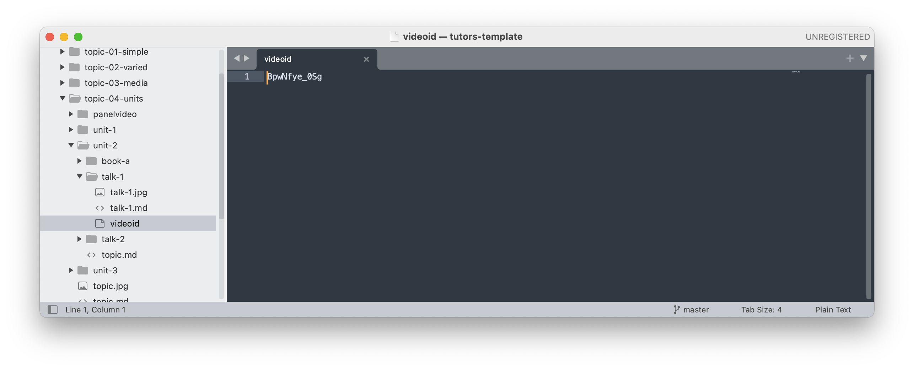
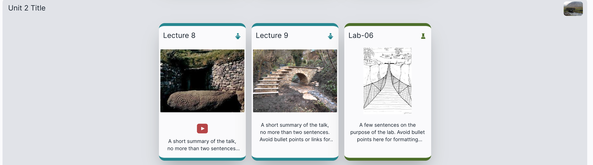
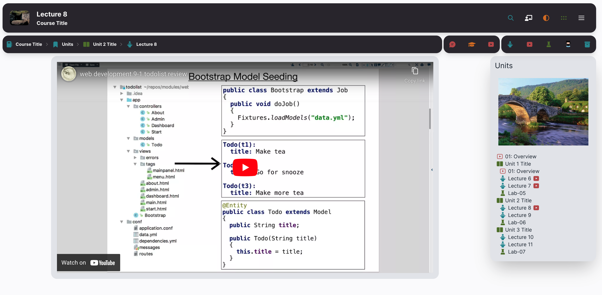

# Video Only Cards

A Video only card represents a video in a talk card form, but without the associated PDF. This is included by including a Talk card, but excluding the PDF:

Selecting any part of the card will take you directly to the video

