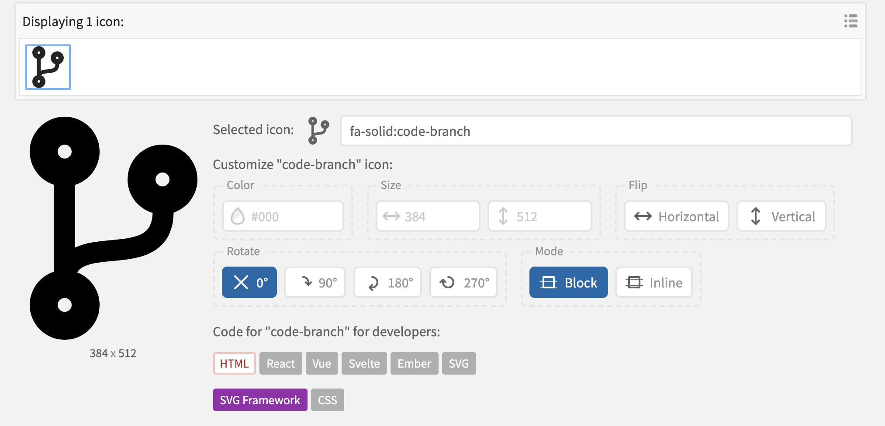

# Course Icon

A course icon will be displayed in the title bar when on the course home page:

The icon also appears occasionally on other areas on the course web.

It can be specified as a single image file in the root folder:

- course.png

Alternatively, you can specify an actual Icon. Select an icon from this service:

- <https://icon-sets.iconify.design/>

Specify the Icon in `properties.yaml` like this:

~~~yaml
icon :
  type: fa-solid:code-branch
  color: FFD601
~~~

The icon descriptor can be located once you identify the icon you like:

An hex colour can be use, or standard web colour:

- <https://www.w3schools.com/tags/ref_colornames.asp>