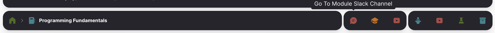

# Companions

The companions toolbar hosts a set of links to external services:

In the above we have:

- Slack Channel
- Moodle Course Web
- Youtube Playlist/Channel

~~~md
slack          : https://wit-hdip-comp-sci-21.slack.com/archives/C01G8QWFC4F
moodle         : https://moodle.wit.ie/course/view.php?id=176625
youtube        : https://www.youtube.com/playlist?list=PLEuhMaR29LyDMF2m4kSS9gVRCuimgo3GU
~~~

We can also have a Zoom link if appropriate.

~~~md
zoom         : https://wit-ie.zoom.us/j/96265735671
~~~

You may choose to have a single companion, or none as approprioate
