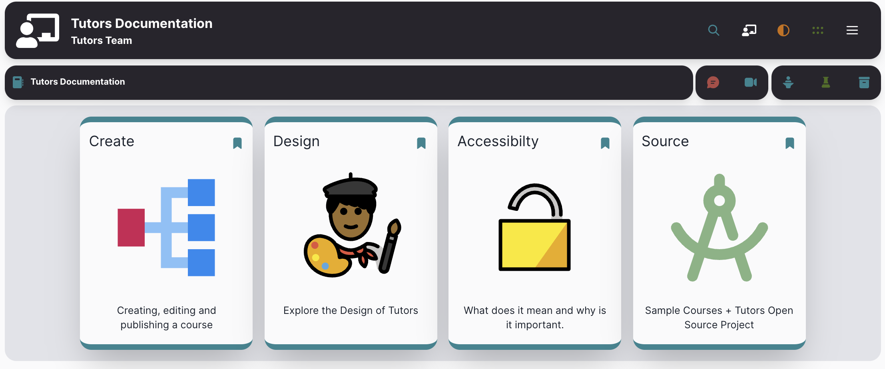
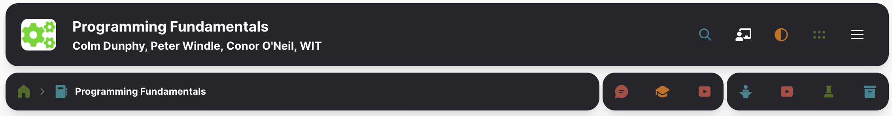

# Course Attribution & Course Parent

The credits entry will be presented as a subtitle on the course home page:

~~~md
credits: Tutors Team
~~~

Any course can also have (optionally) a single `parent` course

~~~md
parent         : course/wit-hdip-comp-sci-2021.netlify.app
~~~

This can be an absolute link, or a relative link to another tutors course (as shown above). The parent will appear in the breadcrumbs toolbar:

This will be represented as a `home` icon as shown above. Clicking this link will load that course into the current window (if a relative link as shown in the snippet above is used).
