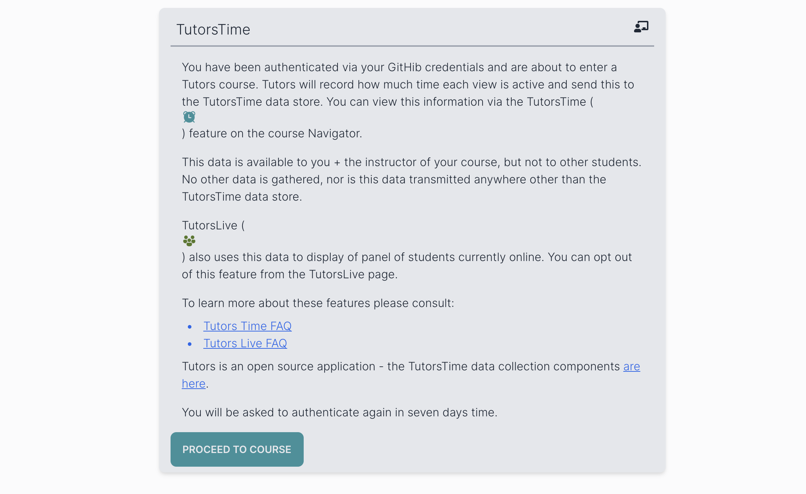
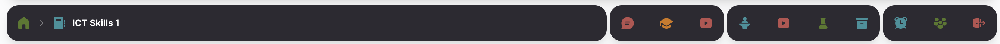
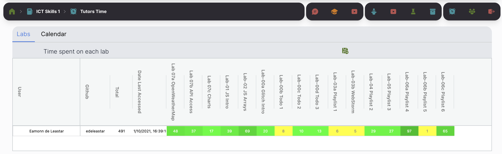
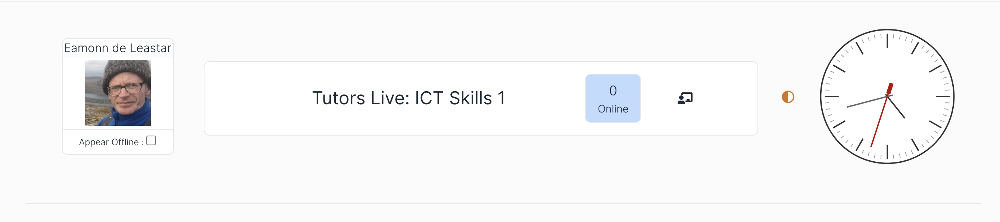

# Authentication, TutorsTime & TutorsLive

By default, tutors courses are public.

You can force users to authenticate before they have access to the course (apart from the landing page) via this setting:

~~~yaml
auth : 1
~~~

With this enabled, then entering a topic will trigger an authentication event:

Users will only be permitted further by Signing in with a valid Github account. Any Github account will be accepted.

When a user is logged in, a new 'Tutors Time' toolbar will be visible on the extreme right:

Some usage data is being gathered for authenticated users - which is now accessible via the first icon in the TutorsTime icon bar (the alarm clock):

The data focuses just on labs - and the number is an estimate of the number of minutes a specific lab has been active for the student.

An instructor can use the PIN code they have set up (`ignorepin`) to reveal data for all students 

The second Icon provides access to `TutorsLive`

This will show a card for each user currently logged in. It will take approx 1 minute to 'warm up' - and then as users come and go to the course web cards will appear and disappear. Students might use this to get in touch which whomsoever is currently online. The card for each student will display useful context information concerning the current activity of the student:

