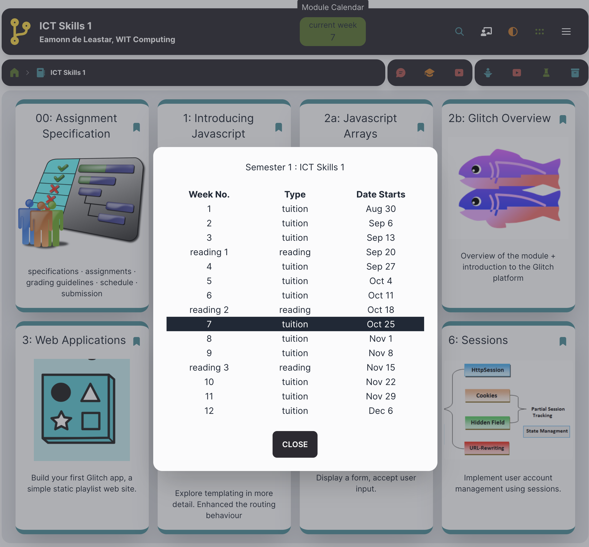
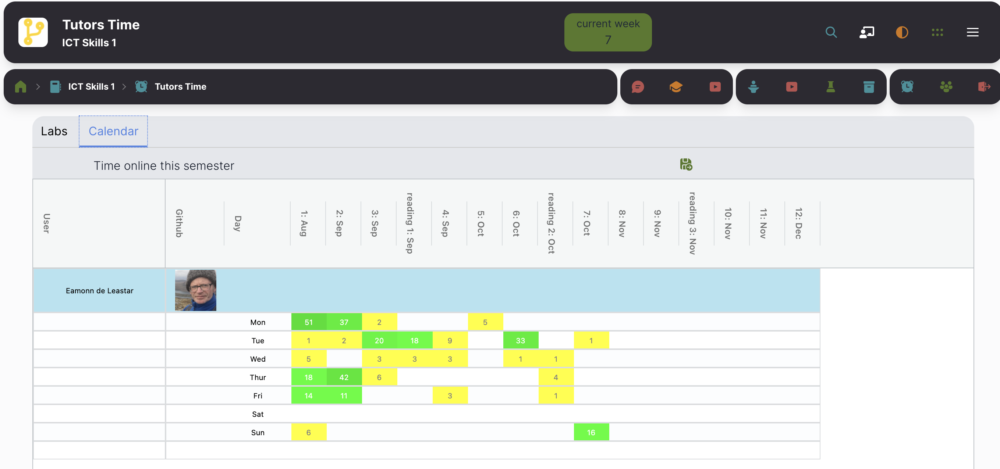

# Calendar

You may choose to prominently display an academic calendar - with the current week number highlighted:

Once set up, the dialog will automatically highlight the current week. To set it up, include a file called `calendar.yaml` into your course folder. Here is an example:

~~~yaml
title: Semester 1
weeks:
  - 2021-08-30:
      title: 1
      type: tuition
  - 2021-09-06:
      title: 2
      type: tuition
  - 2021-09-13:
      title: 3
      type: tuition
  - 2021-09-20:
      title: reading 1
      type: reading
  - 2021-09-27:
      title: 4
      type: tuition
  - 2021-10-04:
      title: 5
      type: tuition
  - 2021-10-11:
      title: 6
      type: tuition
  - 2021-10-18:
      title: reading 2
      type: reading
  - 2021-10-25:
      title: 7
      type: tuition
  - 2021-11-01:
      title: 8
      type: tuition
  - 2021-11-08:
      title: 9
      type: tuition
  - 2021-11-15:
      title: reading 3
      type: reading
  - 2021-11-22:
      title: 10
      type: tuition
  - 2021-11-29:
      title: 11
      type: tuition
  - 2021-12-06:
      title: 12
      type: tuition
~~~

The title of the semester followed by a specification for each week:

- start date
- title
- type

in the format shown in the example above.

Using a calendar in conjunction with authentication adds another dimension to TutorsTime:

This shows estimates of the time online across the semester specified in the calendar file.

An instructor can use the PIN code they have set up (`ignorepin`) to reveal data for all students.
