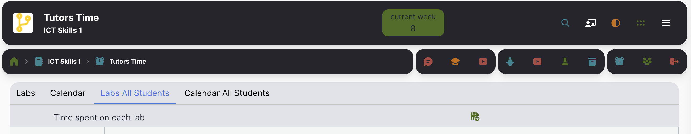

# Enrollment

If authentication is enabled, then any user with a GitHub account can sign in to a course. In some circumstances that can make interpreting the TutorsTime data difficult (as it may include data from users not strictly students on the course). In addition, valid students often do not complete their Github profile, so their entry turns up in TutorsTime as an email only.

To tackle both issues above, you can (optionally) provide an enrolment file -  `enrollment.yaml`. If present, then the TutorsTime reports will be limited to the students listed. Also, the full correctly formatted name of the student will be displayed.

For example, if a students Github ID is 'edel121', and you know that their actual name is 'Edel Jones', then you can format entry in the enrolment file as:

~~~yaml
students:
  - name: Jones, Edel
    github: edel121
~~~

TutorsTime will then render the name as shown above for any data associated with the GitHub id. Also, and GitHub ids not in the list will be surpassed from all reports.

How to get the IDs? The simplest method is to wait for a few sessions, and all students have logged in. Then, in TutorsTime enter the `ignore pin` to reveal `Labs for All Students`

The green export icon (a small disk) will allow you to export all data to an Excel file. Column A and B will contain the names + Github ids for the students. From this you can compose an enrolment file following the format in the example above of all valid students. You might wish to substitute the student name in Column A with a standard layout (last name, first name for instance).

At the moment the contents of the enrollment file is not a Whitelist as such - ie. non-students can still access the module. A future vision of Tutors will provide a flag to exclude non-enrolled students from access to the module.

