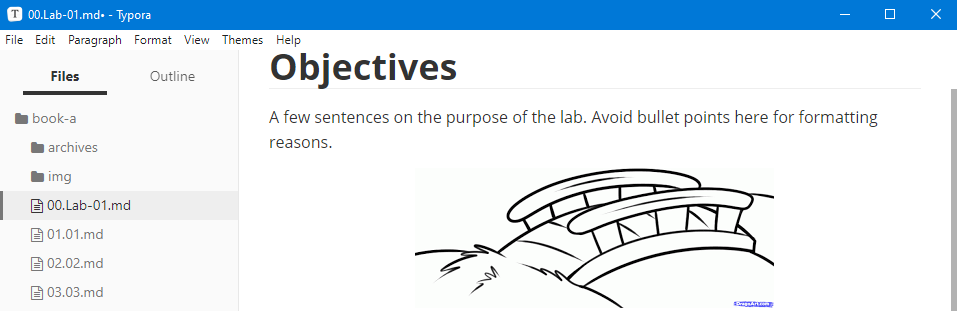
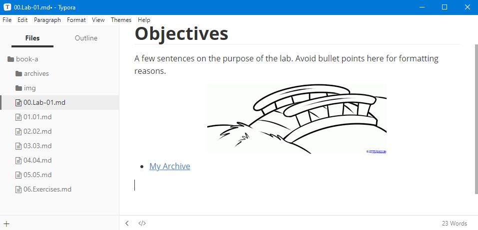
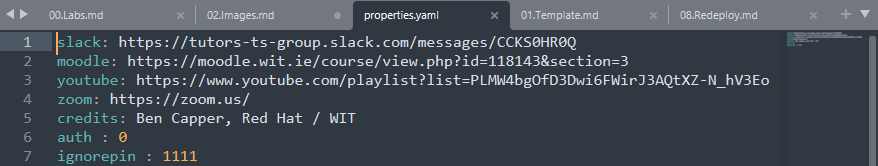

# Images and Archives

Lets add an image and archive to a lab step and go through the process of redeploying the website with the updated files.

1. Select an image to use to test image links. This image must be a `.jpg` or `.png` file.

2. In your `tutors-starter` folder, open `topic-01` -> `unit-1` -> `book-a` -> `img`, then copy your image into this folder.

3. Return to the `book-a` folder and open the `00.Lab-01.md` file.
    
4. Below the sample text, enter the following, replacing the capitalized file name with the name of your own image with the correct file extension:
    - If you arn't sure what file extension your image is, just hover over it, `Right Click` -> `Properties`, then check the `Type of file` field.
    ~~~html
     - Remove the spaces, these are there only to show a relative path.
     - Markdown automatically adds the absolute path.
    ~~~

5. After entering the image line, you will notice that Typora automatically shows the image in the editor.
    

6. Images and archives in Tutors use relative paths, eliminating the need to type out the full path to the image or archive, and instead allows you to start at the `img` or `archives` folders, like so:
    - **Note**: Remove any spaces from the relative paths shown here:
    ~~~hmtl
    
    - [Archive Title](archives / FILE_NAME.EXTENSION)
    ~~~

7. In the above example, notice that an image is denoted by a `!`, while bullet points are denoted by a `-` or `*` followed by a space (` `). This is followed by the image or link title specified by you within the `[]`, and finally the relative file path inside `()`.

8. Archive files which you wish to include must be copied into the `book-a` -> `archives` folder. You can add your own `.zip`, `.rar`, or `.tar.gz` file here, or use the one included for the purposes of this test.

9. Below the image added earlier, type the following, again removing spaces in the path:
    ~~~html
    - [My Archive](archives / archive.zip)
    ~~~
    

10. Navigate back to the root `tutors-starter` folder and open `properties.yaml`. This file can be opened with any text editor, we'll use Sublime Text.
    - To open the file with Sublime, simply `Right click` the file -> `Open with..` -> `More Apps` -> Scroll down to `Sublime`. You may also set Sublime as your default editor for `.yaml` files by selecting the box provided. 
    

11. Enter your details on the credits line of this file and select `File` -> `Save` or press `Ctrl+S`.  