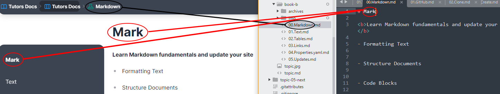

# Lab File Names

1. Lab file names and titles control the output displayed in breadcrumbs and lab pages. Study the following image to see how these correspond:

    

2. The filename controls the breadcrumb output at the lab level, while the file title controls the page title on the sidebar and in the page content itself.         

3. The correct syntax for a filename is `2 digit` step number - `YourWord` - `.md`:

    ~~~html
    00.Markdown.md
    ~~~ 

4. The first 2 digits of the file name determine the order of the lab steps, meaning reordering is as simple as renaming the file.