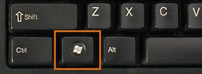
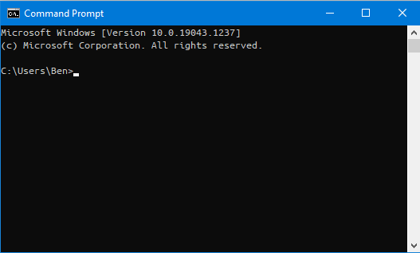
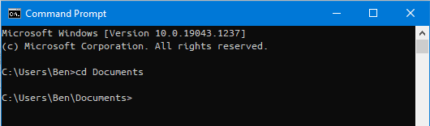
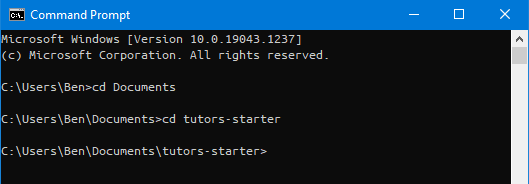
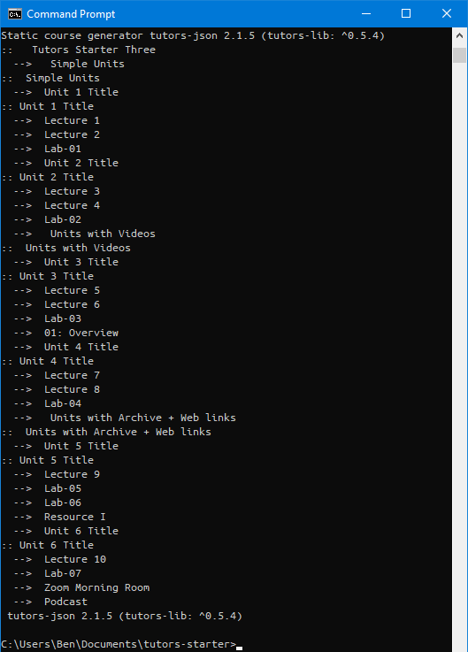
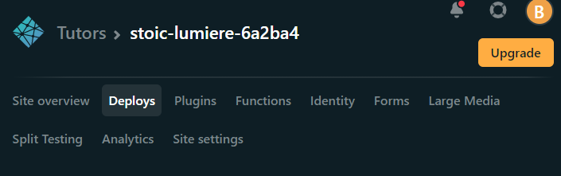
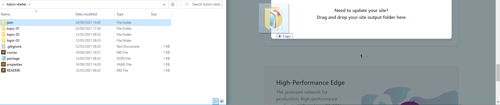

# Regenerate and Redeploy

Each time you make changes to your course files, this process must be repeated for the updates to take effect.

The file structure regeneration process produces the `json` folder located within the `tutors-starter` folder. The course template you downloaded at the start of this tutorial came with a  pre-generated `json` folder for convenience but this folder is now out of date as you have made updates to the files which are used to generate the `json` folder.

To regenerate the `json` folder:

1. Open the Terminal / Command Prompt.
    - This can be done by pressing the `Windows Key`, then type "**command**". You will see this icon appear; select it.
    
    

2. You are now in the terminal which will allow you to traverse through the folders and files on your PC, and run commands. First, you need to change directory to the location of `tutors-starter`.
    - **Note**: The default location in the terminal is the current users `Home` directory. 
    
    - This means that if your `tutors-starter` directory is located in Documents, the command to traverse into the Documents folder is `cd Documents`.
    
    - This is also true for the `Desktop`, `Downloads`, and any other folders located in your user home directory, meaning the commands for these folders would be `cd Desktop` and `cd Documents`

3. Now you are located within the `Documents` folder you can move into the `tutors-starter` folder with `cd tutors-starter`.
    - **Note**: You can do `step 2` and `step 3` with 1 command: `cd Documents/tutors-starter`.

    

4. You are now in the `tutors-starter` folder and can run the following command to regenerate the `json` folder:
    ~~~
    npx tutors-json
    ~~~

5. After the process finishes, it will output a tree depicting your course structure and you will see the type prompt reappear, indicating the regeneration is complete.
    
    
6. Open [Netlify](https://netlify.com) and log in.

7. From the `Site Overview` page, select `Deploys` from the top navigation bar.
    

8. Open your `Documents` directory and navigate to your `tutors-starter` folder. Drag and drop the newly regenerated `json` folder into the box provided by Netlify in the browser.
    

9. The site should take just a few seconds to deploy so you can select the link from the `Site Overview` page and take a look.
