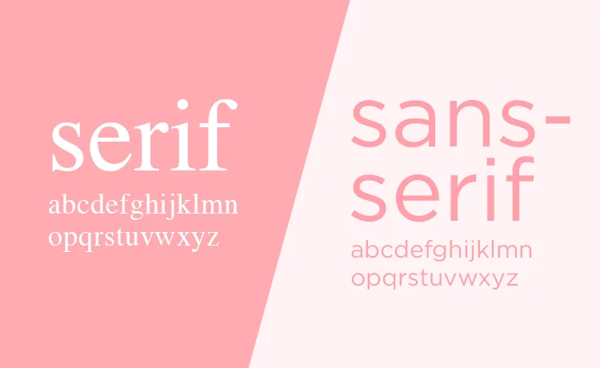
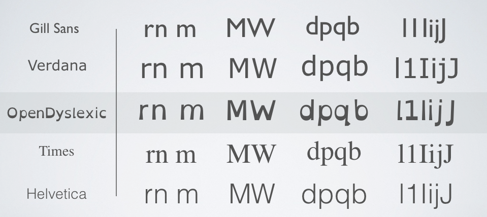
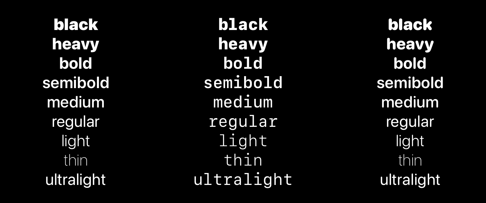

# Font Style

Look at what fonts you are currently using, or want to use. There are some factors you should 
take into consideration:

* Serif Vs. Sans-serif

Sans-serif fonts are easier to read. They do not distort the shape of the letters. 
Many modern fonts for apps are sans-serif because they increase readability and can scale much more easily.

If you want there are some fonts designed specifically for dyslexia. If you can't find one you like, there are several other fonts 
that are dylexia friendly.

* How many weights does the font have?

* Does this font scale well on multiple devices?

Users will access your site from devices with different screen sizes and resolutions.
